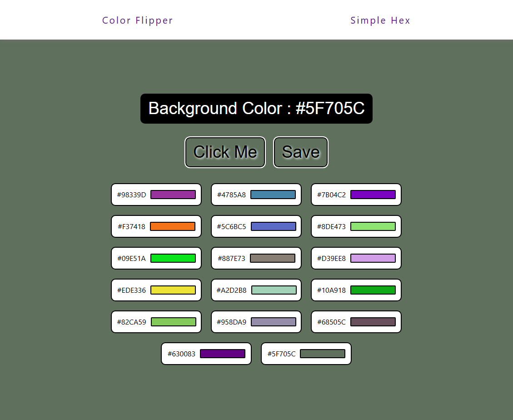
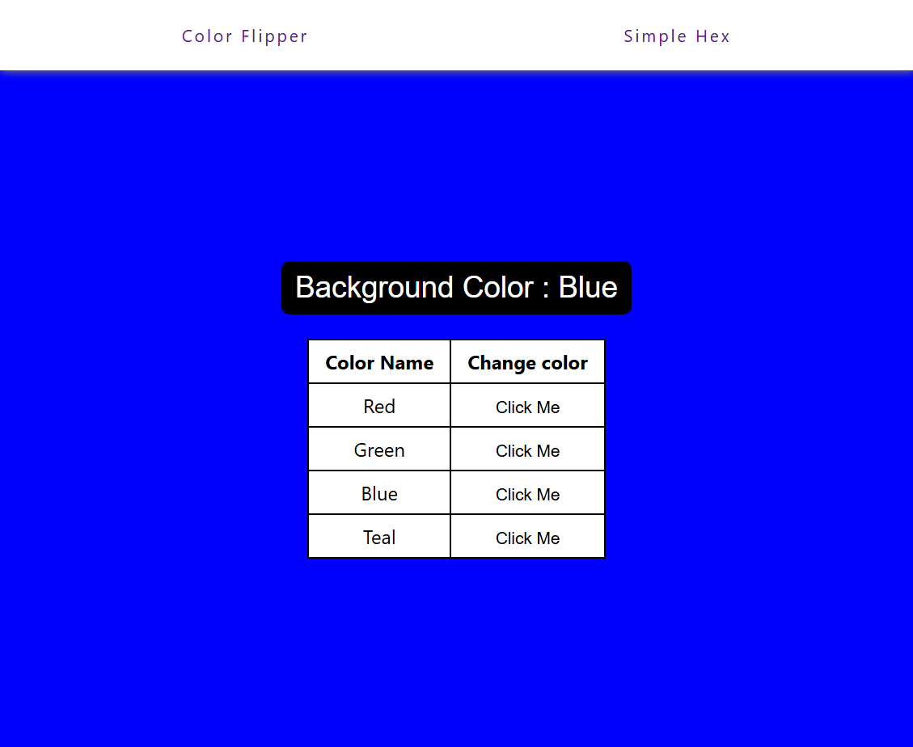

# 🎨 Color Flipper

A simple web app that changes the background color of the page and displays the name of the color. Users can switch between a basic color flipper and a hex color flipper.

## 🌐 Live Demo

[View it in action](https://statuesque-baklava-334477.netlify.app/)

## 📁 Project Structure

## 🚀 Features

- Toggle between different background colors with a button click.
- Shows the current color name.
- Two modes: simple color names and hex colors.

## 🛠️ Setup Instructions

1. Clone the repository:
   ```bash
   git clone https://github.com/0KAshish/color-flipper.git
   cd color-flipper
---

Let me know if you’d like to add deployment instructions (e.g., for GitHub Pages), contribute guidelines, or a license file.

<p align="left">
    
    
</p>


